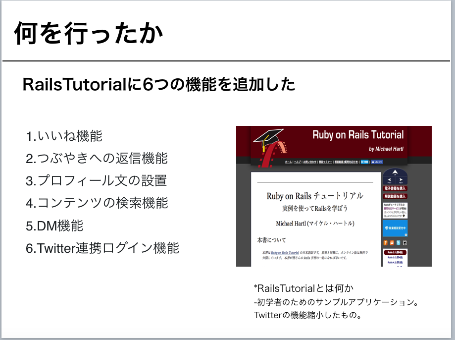
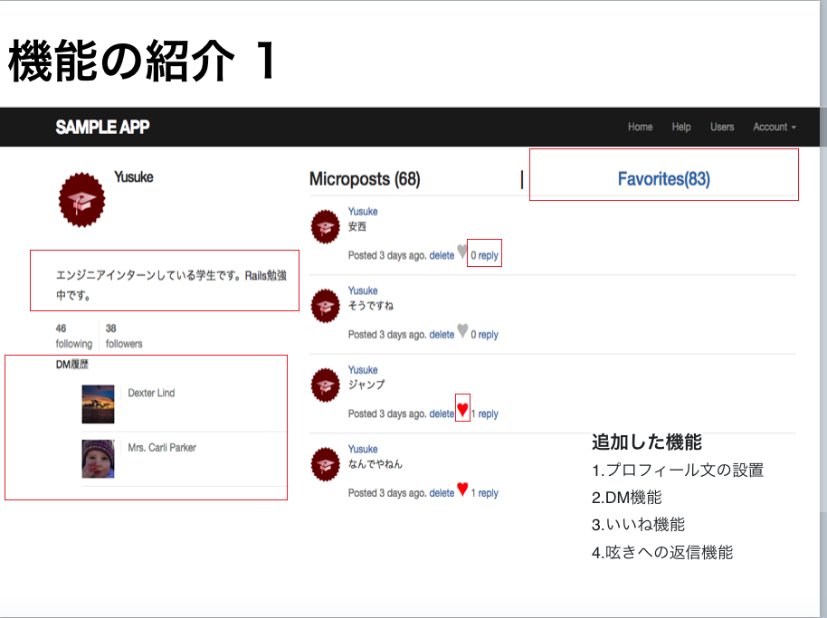
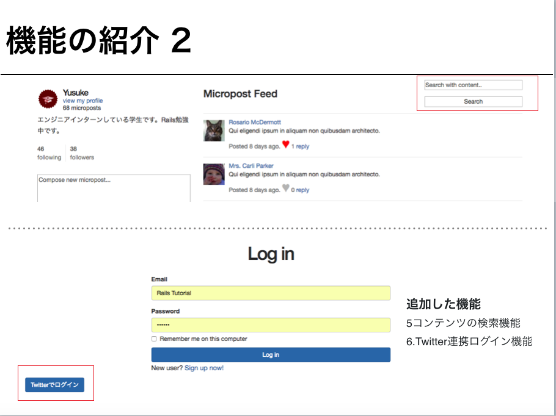

# About

This is my first app written by Ruby in Jun 2018.
I make this app reading Ruby on rails Tutorial(https://railstutorial.jp/).

And I add 6 functions to Ruby on rails Tutorial App.
1. favorites to microposts
2. reply to microposts
3. Add profile sentence to users' profile
4. Search in microposts
5. Direct Message between users
6. Login through Twtter

Please read files below.

